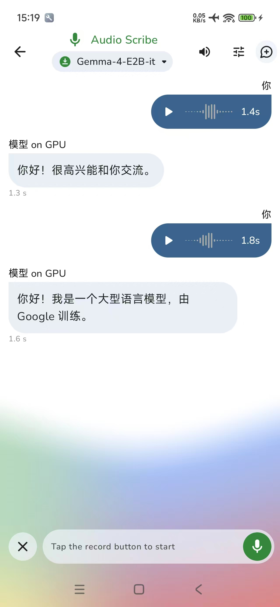
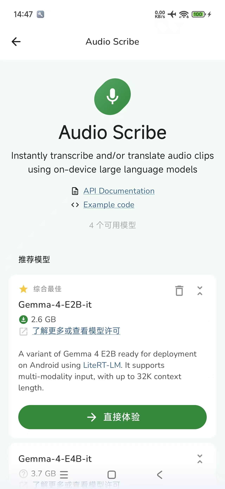
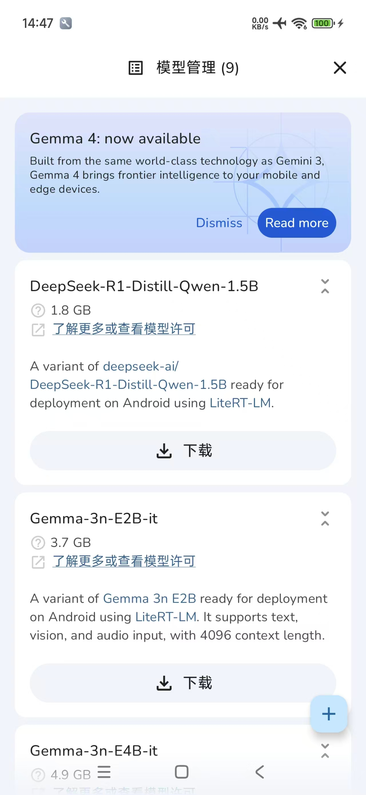

# Google AI Edge Gemma 中文魔改版 ✨

**探索、体验、发现！让世界上最强大的开源端侧生成式 AI 语言模型在您的手机端狂飙。完全离线、注重隐私且快如闪电。**

本项目是基于 Google 官方 [AI Edge Gallery](https://github.com/google-ai-edge/gallery) 的深度定制与本地化增强版本，专为国内开发者与用户打造，致力于扫清在国内体验 **Gemma 4** 等前沿端侧多模态模型时的种种障碍。

## 📱 应用预览

  
  
  

## 🚀 核心升级与特性 (相较于原版)

- 🇨🇳 **全中文界面适配**: 无死角覆盖了所有提示词、设置项与模型配置面板，小白用户也能零门槛轻松上手。
- ⚡ **国内模型源加速直连**: 移除了原版依赖 Hugging Face 海外主站的强制网络限制，国内环境下再也不会频频遇到 `unknown network error` 的连线卡死问题，实现无缝满速拉取。
- 🗣️ **原生流式支持 TTS (原生语音播报)**: 加入了全新底层引擎调度 `TtsManager`，大模型每一次的输出不再是冷冰冰的文本。通过极速切片缓冲正则断句技术，模型在吐出完整短句的瞬间即可同步调用手机底层的高清中文语音库进行发声对答。
- 🔊 **多维音频边界突破**: 在 "Audio Scribe" 多模态语音交互任务下，去除了原项目极为死板的单次语音限制参数 (`MAX_AUDIO_CLIP_COUNT = 1`)。现已解锁连续录入多次语音对话的限制（注意：如遇运行设备内存吃紧或出现 OOM 频闪，请通过界面右上角的扫把图标手动重置 Session 会话以释放显存）。

## 🆕 一触即享的端侧能力

Gemma 4 将海量知识深度浓缩装入了手机内存。现在在断网环境也能完成：
- **Agent Skills**：具备维基百科常识、数学运算引擎支持
- **Thinking Mode**：逻辑思维链外显展示全推理过程
- **Ask Image**：拍照或读取相册进行视觉分析盲填游戏
- **Audio Scribe**：实现无断点的高清语音识别与语义回复对答（本作重磅升级！）

## 🛠️ 构建与编译要求

- **开发工具**: 推荐最新版 Android Studio
- **操作系统环境**: 支持 Android 11+ 及以上设备（API Level 31+）
- **JDK 依赖要求**: 当前项目强依赖于 Gradle 最新的插件，这需要您的 Windows / macOS 编译环境中的全局变量至少配置为 **Java 11 或 Java 17 运行环境**。

### 📱 权限需求与设备隐私

本应用会向系统请求您操作设备的 **相机** 与 **麦克风** 权限保障视觉和听觉模态交互。请放心，所有多模态 Tokens 分析与张量推理**全部在本地 GPU/CPU 上完成**，彻底保障极客隐私。

**⚠️ 合规使用与免责条款**
大型端侧语言模型的响应由参数随机概率生成。开发者在研究或二次分发本项目时，敬请遵守《生成式人工智能服务管理暂行办法》及当地有关法律要求。**坚决禁止利用本项目或内置模型进行任何涉黄、暴恐、煽动国家分裂等违法违规内容的散布。** 所生成的结果可能存在偶发幻觉断想，在未经过滤前提下无法作为精密医疗、司法财务之事实证据或核心决策标准。

## 🤝 开源协议

本项目持续遵循 [Apache 2.0 License](LICENSE) 规范，核心框架起源于 Google AI Edge 工程并由社区深度发掘改良。欢迎大家提 Issue 或者通过 Pull Request 一起建设移动端 AI 生态！
